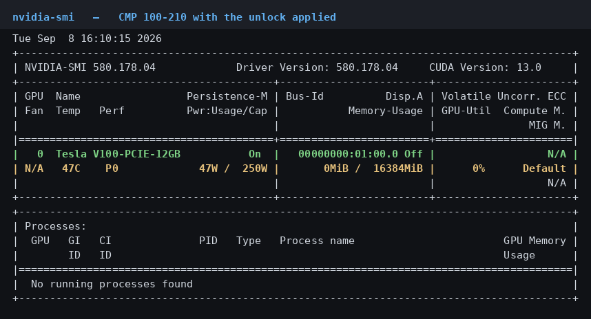
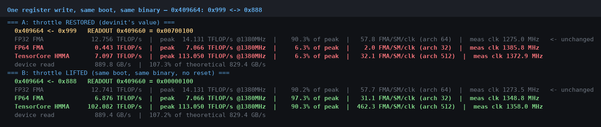
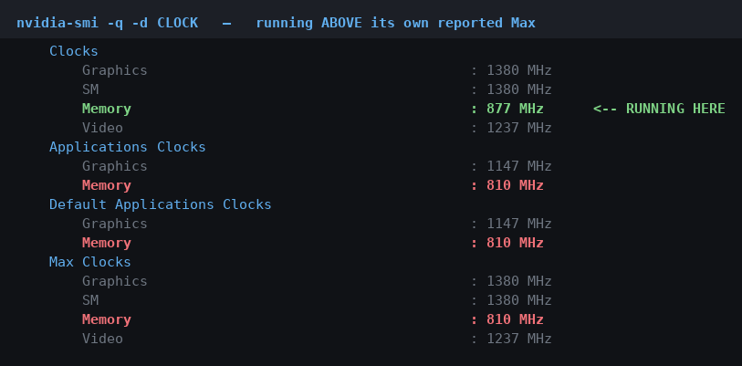

# CMP 100-210 unlock

Lifting the firmware restrictions on an NVIDIA **CMP 100-210** (GV100 / Volta, `10de:1df4`), the
mining SKU of the Tesla V100, by getting arbitrary PRI writes at **privilege level 3** out of a bug
in NVIDIA's own boot firmware.

Validated end to end on hardware. **FP64 15.5×, tensor cores 14.4×, PCIe 3.95×, memory +8.4%.**



## Boards tested

**One.** Everything in this repository was developed and measured on a single card:

| PCI ID | Board | VBIOS | InfoROM | Result |
|---|---|---|---|---|
| `10de:1df4` | CMP 100-210, PG500 SKU 111, board PN `900-1G500-0040-000`, PCB `699-1G500-0111-300` rev A02 | `88.00.51.00.04` | `G001.0000.01.04` | full stack validated, 0 Xids |

Related parts, none of them tried:

| PCI ID | Part | Expectation |
|---|---|---|
| `10de:1db4` | Tesla V100-PCIE-16GB (PG503 SKU 201, VBIOS `88.00.4F.00.09`) | ships a **byte-identical FWSECLIC image**, so the chain should apply, but it has none of the restrictions to lift |
| `10de:20c2` | CMP 170HX (GA100) | different architecture. The fuse block moved to `0x820000`, PLMs are 4-level, and every address in this kit is wrong there |
| `10de:1e09`, `10de:1ebc` | CMP 50HX (TU102 / Turing) | 4-level PLMs, 32 decode traps, SEC2 at a different base. Not applicable as written, though Turing keeps the pre-Ampere fuse array |
| `10de:16e8` | CMP 90HX | sampled only for the FWSECLIC version check, where it is on the unguarded side. Nothing else tried |

If you run this on a second `1df4` and it behaves differently, that is the single most useful thing
you could report back. `tools/rom_compat.py` and `tools/preflight.py` exist to tell you *how* it
differs before anything is written.

## Credits

This is built on other people's work.

* **BlackSun**, for finding that NVIDIA's **PRI decode traps** can be turned into a privilege
  escalation, on the CMP 170HX. A trap armed with `ACTION.SET_PRIV_LEVEL` and `DATA1 =
  0xC0000000` stamps a matching host write to level 3. Section 2.4 is that idea moved to Volta,
  where the trap block and the arming path both differ but the mechanism is theirs.
* **zorg33**, for the **SPI write procedure** on the 170HX: driving `SPI_CTRL` / `SPI_DATA_ARRAY`
  directly to issue JEDEC frames (`WREN`, page program, `RDSR` polling) and bypassing nvflash's
  flash service. That is what reaches the region nvflash refuses, everything below physical
  `0x00EE00` including the IFR, and it is how the width edit gets delivered. Comparing that
  write-up against Volta is also what showed the Ampere pad-mux wall (`PAD_SHARE`, `SPI_ARBITER`)
  does not exist here.
* **NVIDIA**, for the primitive. The unbounded copy in section 2.2 is their code, and so is the
  error name it eventually got in later firmware, `NV_PREOS_ERR_INFOROM_BUFFER_OVERFLOW`.

Mistakes in the porting, the measurements and the conclusions are mine.

---

## 1. What is actually restricted

The die is an unrestricted 80-SM V100. A whole-die census (39,930 named BAR0 registers, 1508 PLMs,
the 256-row OTP array) says the restrictions are **not** in silicon and **not** in fuses:

* `OPT_PCIE_DEVIDA` = `0x1DB4`. This die is a V100-PCIE-16GB.
* `OPT_SM_FMLA_SPEED_SELECT`, `OPT_SM_IMLA_SPEED_SELECT` and `OPT_DP_SPEED_SELECT` all read **0**.
  Nothing is throttled by fuse.
* Zero GPC / FBP / FBPA / FBIO / ROP_L2 / PES floorsweeping. 80 SM, two TPCs cut (one genuinely
  defective, one binned).
* `OPT_ECC_EN` = 1, and the HBM2 dies report ECC-capable.

Diffing the CMP VBIOS against a stock Tesla V100 **at the devinit register-write level** (decode
`INIT_NV_REG` / `INIT_ZM_REG`, then compare only records at matching file offsets) collapses 377
differing legacy bytes to **7 differing writes out of 431**. Five of them are of substance:

| devinit writes | effect |
|---|---|
| `0x409664` ← `0x999` | FP64 and tensor cores to 1/16 rate |
| `HBMPLL_COEFF` NDIV 60 (vs 65) | memory 810 MHz instead of 877.5 |
| `0x088610` ← `0` (vs `0x1001`) | PCIe capped at Gen1 |
| `CTRL_OPT_NVENC` ← 7, `CTRL_OPT_NVDEC` ← 1 | all four video engines floorswept off |

**The card is a Tesla V100 that is told to behave worse at boot.** The rest of this is about
countermanding those instructions.

---

## 2. The primitive

Three of the four unlocks need no exploit at all. They are plain L0 register writes into blocks
whose PLMs are already open. Only the FP64 and tensor throttle is privileged, and it is the reason
any exploit was needed.

### 2.1 Why a privilege escalation is needed

`0x409664` is guarded by its own priv-level mask at `0x409650`, which reads `0x8F`. On Volta's
3-level PLM layout that is `WRITE 6:4 = 0`, meaning write level 3 only. A host write at L0 bounces.

There is no designed path to L3, and that is confirmed from NVIDIA's own source. HS entry halts
unless `SCTL.LSMODE` is already true; LS is granted only by ACR writing `SCTL`; and `SCTL_PLM =
0x47` requires L2 to make that write. L3 needs HS, HS needs LS, LS needs L2, L2 needs LS. No L0
entry exists by construction.

So the escalation has to come from a bug in code already running at L3.

### 2.2 The bug: an unbounded copy in FWSECLIC

`FWSECLIC` is a falcon ucode that runs on the PMU in HS at level 3 on every boot. Before it
verifies the VBIOS certificate it parses the InfoROM. Function `0x607E` copies an InfoROM object's
**self-declared U16 size** out of the ROM into a fixed 1123-byte global DMEM buffer at `0x49D9`,
with no bound check:

```
0x607E   read the INFOROM_OBJECT_HEADER_V1_00 ("3s2bwb", NVIDIA's own format string)
         size = u16 at packed offset 5          <-- attacker-controlled, straight from flash
         copy `size` bytes to D[0x49D9]         <-- no comparison against the destination
```

That buffer sits `0x5483` bytes below the falcon return address at DMEM `0x9ED8`, and the stack
canary is a compile-time constant: `D[0x1B0] = 0x00006BD1`, with 72 loads and 0 stores. Overwrite
the canary with its own known value and the return address with anything, and you do not get a
crash. You get **`$pc` control at level 3**.

This is NVIDIA's bug, and NVIDIA names it. Across 12 VBIOSes and 4 architectures, later FWSECLIC
builds add a check at exactly this site staging `NV_PREOS_ERR_INFOROM_BUFFER_OVERFLOW = 0x202A`.
Every CMP part sampled (100-210, 170HX, 90HX) is on the unguarded side. The boundary is a VBIOS
branch rather than an architecture: a stock Tesla V100 ships the byte-identical FWSECLIC image.

### 2.3 Turning `$pc` into arbitrary PRI writes

A single `$pc` is not much use; what is wanted is a sequence of privileged writes. FWSECLIC
contains a suitable gadget, and the frame the copy lands in is deep enough to chain it:

```
0x22C5   mov b32 $r10 $r1      ; address
0x22C7   mov b32 $r11 $r0      ; value
0x22C9   lcall 0x2294          ; the PRI write
0x22CD   mpopret $r1           ; pop the next (value, address) and return to the next link
```

Each link costs **12 bytes of stack**: two words popped by `mpopret $r1`, one word of next-`$pc`.
Point the last link at a resume gadget whose stack consumption lands `$sp` exactly where the
original caller's return address sits, and FWSECLIC carries on booting as though nothing happened.
The chain length falls out of that arithmetic, `nlinks = (0x9F28 − pop − 0x9EDC) / 12`, so the
resume gadget is what selects it. `0x41AC` (`mpopret $r3`, pop `0x10`) gives 5 links and restores
`r0` through `r3`, which the continuation at `0x5908` needs.

> A 6-link chain (`0x046A`, `mpopret $r0`) also lands all its writes, and halts the PMU on every
> boot, because it only restores `r0`. Recoverable, but there is no reason to go there.

### 2.4 What the five writes do

The payload does not aim at `0x409664`, and it cannot. RM's POST reprograms all 22 PRI decode-trap
slots for its own use, so the chain's window (pre-POST) and the target's window (post-devinit) do
not overlap.

Instead the chain spends its writes on making the target reachable later:

```
0x122750 <- 0x00000FFF     decode-trap 20's own PLM: open the slot to host L0 edits
0x1224D0 <- 0xFC000000     MASK    address-exact match
0x122550 <- 0xC0000000     DATA1   SET_PRIV_LEVEL value = LEVEL_3
0x122650 <- 0x00100000     ACTION  SET_PRIV_LEVEL
0x409650 <- 0x000000FF     the FECS PLM, 0x8F -> 0xFF
```

Two independent capabilities come out of that.

1. **A general L3 write primitive.** With trap 20's PLM open, the host re-aims `MATCH` freely at
   L0, and any host write matching it is stamped LEVEL_3 and lands, including on registers that
   refuse an L0 write. `MATCH` does not need to come from the chain, because it boots as 0 and that
   is inert, which is what frees the fifth link. Verified with unmatched controls: the same write
   bounces unstamped and lands stamped.
2. **The FP64 unlock, pre-armed.** `0x409650 = 0xFF` makes `0x409664` plain-L0 writable for the
   rest of the boot. Unlike the trap, a PLM survives PGRAPH power-up and RM's trap teardown. That
   is the useful part of the whole design: spend the privileged write on the lock rather than on
   the target.

The payload is 90 bytes inside the InfoROM. An ordinary VBIOS reflash delivers it, and it re-fires
from ROM at every boot.

---

## 3. How it is applied

Ordering is what makes this work. Two of the four levers have windows that do not overlap:

```
device reset ──► [PCIe retrain] ──► load driver (devinit runs) ──► [FP64] ──► [memory clock]
                 pre-POST only                                     post-POST  post-POST, IDLE
     │
     └─ the ROM chain fires here: trap 20 arms, FECS PLM opens
```

| lever | needs the primitive? | mechanism |
|---|---|---|
| **PCIe Gen1 → Gen3** | no | clear 4 CYA bits in `NV_XVE_PRIV_MISC_1` (`0x08841C`), then retrain from the upstream port. devinit latches the capability, so this has to land before the driver. A Gen3 link trained in that window survives devinit: RM re-clamps `LnkCap` but does not force a downshift. |
| **memory 810 → 877.5 MHz** | no | a 6-step sequence: `MEMCLK_CHANGE_ALERT`, self-refresh, per-FBPA PLL disable / reprogram / relock, DDLL recal. `NV_PFB_FBPA_FBIO_PRIV_LEVEL_MASK` was `0xFF` all along. Privilege was never the obstacle; sequencing was. |
| **FP64 + tensor** | **yes** | the ROM chain opens `0x409650`, then `0x409664 <- 0x888` at plain L0 after the driver loads. |
| video engines | n/a | closed. The mask lift lands perfectly and the GPU falls off the bus 4.5 s later with Xid 79, because devinit skipped the engines' bring-up. The fix would have to be inside devinit. |

```bash
bash tools/unlock_all.sh --bdf <bdf>          # enforces the order; --dry-run rehearses it
```

---

## 4. Results

### FP64 and the tensor cores

Once `0x409650` is open the throttle becomes a live toggle, on a running GPU with a CUDA context,
with no reload and no reset. That allows a clean A/B: same boot, same binary, one register write
apart.



| | throttled (`0x999`) | lifted (`0x888`) | |
|---|---|---|---|
| FP64 | 0.443 TFLOP/s, **2.0**/32 FMA/SM/clk | **6.876**, 31.1/32 | **15.5×** |
| TensorCore HMMA | 7.097 TFLOP/s, **32.1**/512 | **102.082**, 462.3/512 | **14.4×** |
| FP32 | 12.756 TFLOP/s | 12.741 | unchanged |

Both throttled figures are exactly 1/16 of the architectural rate, flat across 9 occupancy and ILP
configurations, which is a hardware rate divider rather than a latency artifact. FP32, INT32 and
FP16 were never throttled (63.7/64, 58.8/64 and 112/128 FMA/SM/clk at stock) and they do not move,
which is what shows the lift is specific to those pipes and not a clock effect.

Numerically validated, not just timed:

```
DGEMM  fp64    max abs err 8.882e-15  (bound 9.095e-13)   over bound: 0   CORRECT
HGEMM  tensor  max abs err 4.532e-05  (tol 3.2e-02)       over tol:   0   CORRECT
```

### Memory clock

`nvidia-smi` reports the card running above its own advertised maximum: 877 MHz against a
`Max Clocks → Memory` of 810.



Device read goes 820.8 → **889.4 GB/s** (+8.4%), at 99% of theoretical on both sides. Validated
with 12 GiB × 4 patterns × 2 passes clean, because a memory clock change can corrupt silently and
a bandwidth number on its own proves nothing.

### PCIe

H2D **0.20 → 0.79 GB/s**, D2H **0.21 → 0.83**, so **3.95×**. The naive 8/2.5 = 3.2× is wrong
because it ignores the encoding change: Gen1 is 8b/10b and Gen3 is 128b/130b, so the true ceiling
ratio is (8/2.5)·(0.9846/0.8) = 3.94, which is where the measurement lands.

> `nvidia-smi` reports `pcie.link.gen.current = 1` on a physically-Gen3 link, permanently, because
> it reads the re-clamped capability. Trust lspci `LnkSta`, sysfs `current_link_speed`, or measured
> throughput.

### PCIe width: the firmware limit comes off, the payoff is your board's

The x1 link is not in the VBIOS. It is in the IFR, at physical flash `0x214`: a record that
read-modify-writes `XP_PL_LINK_CONFIG_0` to force `LINK_SPECIFIER` to lanes `00_00`. Retargeting
that record at the read-only `XP_PL_LINK_PRESENT` neutralises it, and that is one byte, `0x42 →
0x02`, a single bit going 1 to 0, so there is no erase and no partial state. It is delivered over
the L3 SPI stamp, because nvflash's PMU flash service refuses every write below physical
`0x00EE00`.

It works, and it was measured:

```
LINK_SPECIFIER               0x01 -> 0x10      (lanes 00_00 -> 15_00)
XVE_LINK_CAPABILITIES width     1 -> 16
lspci  LnkCap                  x1 -> x16       card enumerates normally
```

Width has two gates and this removes the firmware one. The second is physical: on this SKU the
series AC-coupling capacitors for the additional lanes are depopulated, leaving empty pads. PCIe
negotiates width by per-lane receiver detection, and a lane with no coupling capacitor has no AC
path, so no partner is detected and the link trains x1 whatever either end advertises. That is what
happened on the reference bench.

The traces are present and the capacitors are not, which makes full width a soldering job rather
than a dead end: fit capacitors matching the value of the populated ones on the working lane. This
kit removes the firmware gate and the rework removes the other. That rework has not been performed
here, so it is reported from board inspection rather than verified.

> `XP_PL_LANE_PRESENT` is not predictive. It reads `0xFFFF`, 16 lanes present at the PHY, on a card
> that trains x1. Inspect the board instead, looking for empty pad pairs on the lane traces near
> the edge connector alongside the populated ones on the working lane.

The write path ships as an escalation ladder. `spi_rdid_l3.py` (is the engine reachable?) and
`spi_status_l3.py` (is the chip protected?) are read-only. `spi_write_ifr_l3.py` then does the one
byte behind six interlocks, and contains no erase opcode anywhere in the file. `spi_flash_l3.py` is
the general read / erase / program tool for everything else; pointing that one at sector 0 is how a
card is lost, because an interrupted erase leaves the IFR blank.

⛔ This is the highest-risk change in the kit and the only one that can stop a card enumerating. It
writes flash sector 0, the IFR, which programs `ROM_ADDR_OFFSET` and the PCIe config, and there is
no in-band way back. Attach a **1.8 V** programmer first.

### Whole card, one boot

FP64 **6.85**, tensor **101.8**, FP32 **12.7 TFLOP/s**, read **890 GB/s**, H2D **0.79 GB/s**,
memtest clean, GEMMs correct, **0 Xids**. A stock-performance Tesla V100.

Raw output for all of the above is in [`docs/evidence/`](docs/evidence).

---

## 5. What is closed, and why

Recorded because the negative results cost as much as the positive ones.

* **A permanent VBIOS fix.** All five devinit words could in principle just be edited in the ROM.
  They cannot be: RM refuses to POST a card whose legacy image or NVIDIA ucode images differ by
  even one byte, giving `RmInitAdapter failed! (0x31:0xffff:2780)`. Demonstrated at three separated
  offsets, 6/6 reproducible, including with two bytes of inert `0xFF` padding and both checksums
  preserved. The card's own firmware is happy throughout (`BIOSCERT_ERR = 0`, chain fires, PMU
  healthy) and only the driver objects, so the check lives in `nv-kernel.o`. The same edit inside
  the third-party EFI image POSTs 3/3, so it is a policy about NVIDIA-authored images rather than
  an address range.
* **ECC.** The gate is one VBIOS bit, `bFlag5` bit 0 `SKU_SUPPORTS_ECC`, which RM reads from a
  parsed struct in host memory. No register write, PLM, trap stamp or fuse override can reach it,
  and the byte is inside the legacy image, behind the wall above.
* **Video engines.** See section 3. A runtime lift gives Xid 79. Do not re-attempt.
* **NVLink.** Fused off, all six links, `OPT_NVLINK_DISABLE = 0x3F`. The silicon is intact but
  there is no firmware path around a burned fuse.
* **No LHR-style flag.** Volta does have one, `bFlag6` bit 7 `REDUCE_MINING_PERF`, and this SKU's
  `bFlag6` is byte-identical to a stock V100's. Nothing to find there.

---

## 6. Using this

Start with **[`PORTING-2026-09-08-other-cards.md`](PORTING-2026-09-08-other-cards.md)**: risk
ladder, prerequisites, five phases from an offline self-test to rollback, and a table of what to do
when your card does not match this one.

```bash
bash tools/kit_selftest.sh                   # offline, no hardware
bash tools/bench/build.sh                    # compile the benchmarks (needs nvcc)
python3 tools/preflight.py <bdf>             # on-card GO/NO-GO, strictly read-only
python3 tools/rom_compat.py <your-dump.rom>  # offline GO/NO-GO on your card's own ROM
```

### Two things that will cost you a card

⛔ **The flash chip is 1.8 V.** It is a Winbond W25Q80EW, `Vcc 1.65 to 1.95 V`, and a stock CH341A
drives 3.3 V and destroys it. Use a 1.8 V-capable programmer and check the rail with a meter,
because several boards sold as "1.8 V" only shift the data lines and still feed 3.3 V to Vcc.

⛔ **One memory-clock switch per boot.** The `--ndiv 60` "no-op control" is itself a switch. Running
it and then the real switch produced Xid 62 and a deadlocked RM, and recovery was a device reset.
`tools/hbm_mclk_switch.py` now refuses the second one and names the reset you need.

### No firmware images are published here

Each 1 MiB VBIOS image contains its card's InfoROM, which holds the serial number, UUID and board
part number. They would also be useless to you, because the InfoROM object the chain is written
into sits at a different address on every card, so a payload has to be built from your own dump.
`tools/rom_compat.py` derives that address, verifies the FWSECLIC build by IMEM hash and by eight
per-VA gadget byte signatures, and prints the exact build command for your card.

---

## 7. Scope

Developed and validated on exactly one CMP 100-210, as the table at the top says. It has never been
run on a second card. That the approach generalises is a hypothesis: the FWSECLIC image is
byte-identical on a stock V100, which points that way, but nothing has tested it. Section 10 of the
porting guide covers how to find out, and section 11 covers what to send back.

No warranty. This modifies firmware on hardware you own, at your own risk. Nothing here is endorsed
by or affiliated with NVIDIA.
